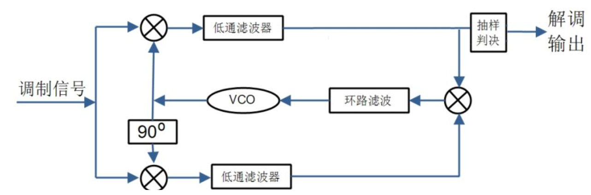

SEU信息学院综合课程设计（通信组）  
vivado版本：2020.1
# 实验参数
+ 基带速率：1.024Mbps
+ 载波频率：2.048MHz
+ A/D采样速率：8.192MHz
+ 输入数据位宽：16bits

# 原理
### 调制方式
--- 
采用DPSK调制，对基带数据进行差分编码，再转为双极性码，之后直接与DDS产生的载波相乘得到调制信号，这样可以消除相干解调时出现的相位反转现象。
### 解调方式
---
实验中2PSK信号的解调采用相干解调法，首先要从调制信号中提取相干载波，在实验中采用数字costas环提取相干载波，其原理如下图所示：  

  

之后对costas环的解调输出进行数字锁位同步，并进行差分译码，最终得到解调信号。